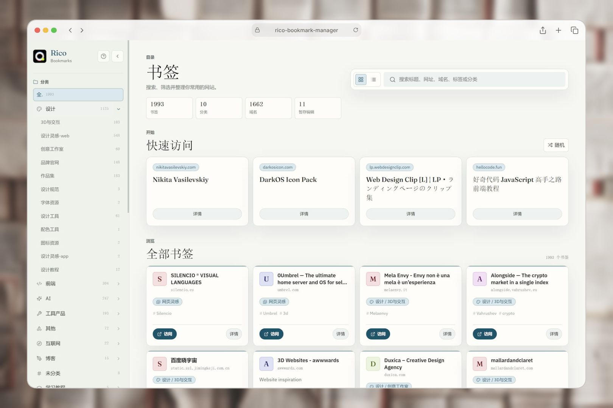
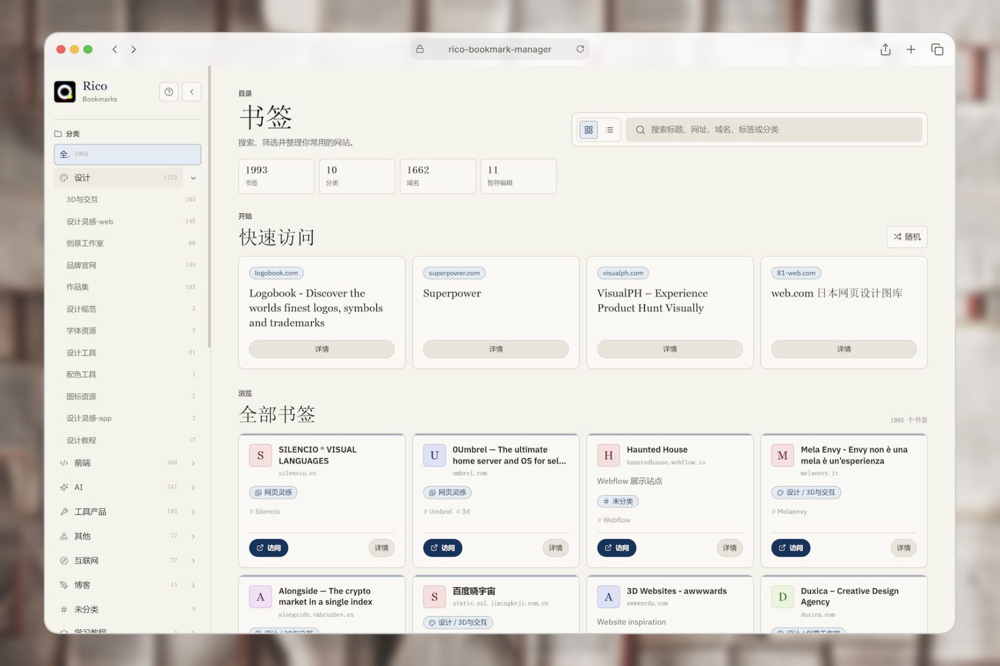
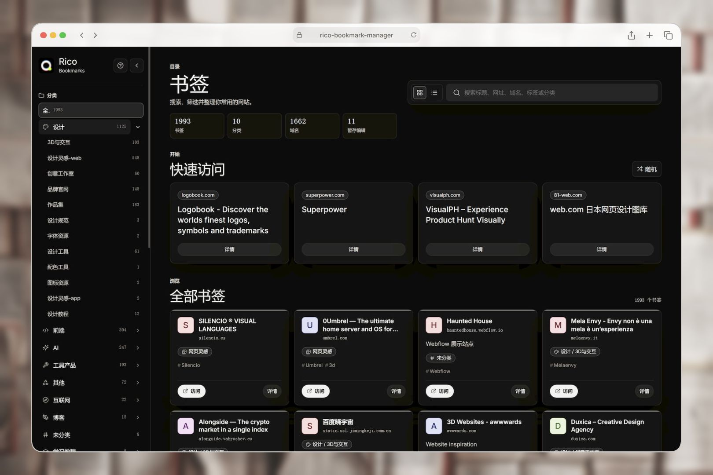
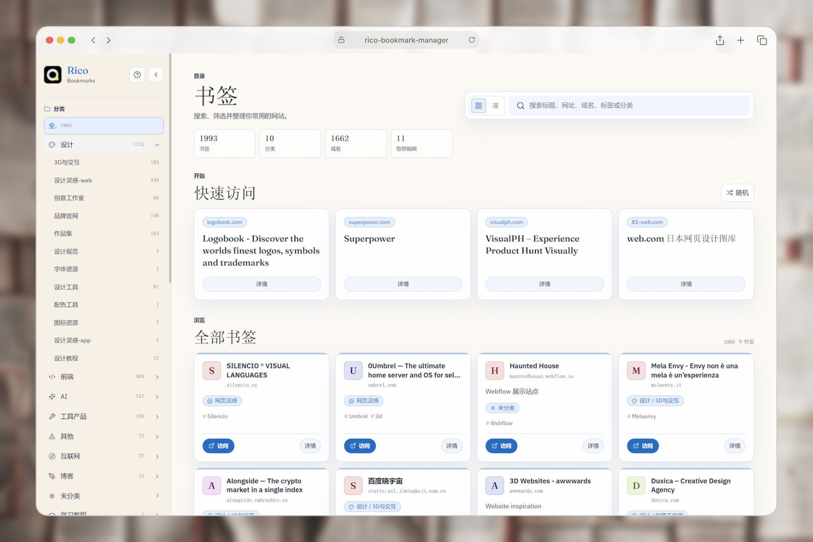
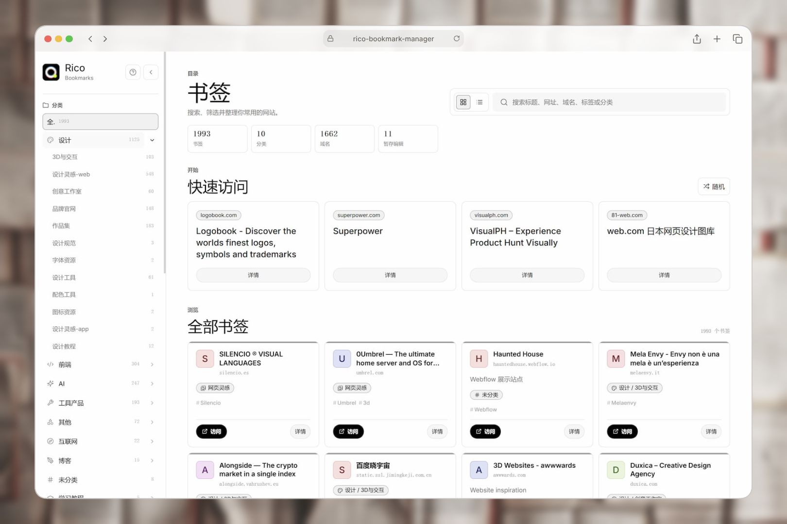

# Rico Bookmarks Manager

Turn a messy browser bookmark export into a clean, searchable, local navigation site — plus structured data, Markdown overviews, and review reports. Works as a skill and as a standalone, dependency-free Python CLI.

Chinese documentation: [README.zh.md](README.zh.md)



## Preview

The generated navigation site ships with five built-in themes — `ease`, `kami`, `minimal-mono`, `retro-blue`, and `ui`:

| | | |
| :---: | :---: | :---: |
| <br>`ease` (default) | <br>`kami` | <br>`minimal-mono` |
| <br>`retro-blue` | <br>`ui` | |

## What It Does

- Parses browser bookmark exports into structured `bookmarks.json`.
- Analyzes folder structure, category distribution, duplicate URLs, and low-confidence items.
- Classifies bookmarks into `source`, `optimized`, or `hybrid` category paths.
- Detects dead links when network checks are enabled.
- Merges new exports into existing data for incremental updates.
- Exports Markdown overviews and browser-importable HTML (ready to import back into your browser).
- Generates a local static navigation site with search, filters, reports, exports, themes, and local staging edits.

## Installation

Install as a Claude Code skill in one of three ways. The repository root **is** the skill, so it maps directly into your skills directory.

```bash
# Option 1: one-line install with npx (recommended)
npx skills add https://github.com/ricocc/rico-bookmark-manager.git

# Option 2: git clone into the Claude Code skills directory
git clone https://github.com/ricocc/rico-bookmark-manager.git ~/.claude/skills/rico-bookmark-manager

# Option 3: download the ZIP and unzip it into the skills directory
#   macOS/Linux: ~/.claude/skills/rico-bookmark-manager/
#   Windows:     %USERPROFILE%\.claude\skills\rico-bookmark-manager\
```

After install, the layout looks like this:

```text
~/.claude/skills/rico-bookmark-manager/
├── SKILL.md
├── scripts/rico_bookmarks_manager.py
├── assets/
└── references/
```

### Verify the install

Restart Claude Code or reload skills, then type in a conversation:

```text
/rico-bookmark-manager
```

Or just say "rico, organize my bookmarks". If the skill activates, the install worked.

## Use with AI (recommended)

Once installed, **the most natural way to use it is in conversation, with plain language** — no commands to memorize. Two ways:

```text
# Option A: explicit slash invocation
/rico-bookmark-manager organize bookmarks.html and build the navigation site

# Option B: natural trigger in conversation
rico, organize my bookmarks
```

Common scenarios (what you say → what happens):

| You can say | What happens |
| --- | --- |
| "rico, organize my bookmarks and build a navigation site" | Parses your bookmark HTML, classifies it, and generates the local site. |
| "deduplicate my browser bookmarks and check for dead links" | Finds duplicates and broken links, and produces review reports. |
| "rebuild the navigation site with the retro-blue theme" | Rebuilds the site with the chosen theme. |
| "merge this new export incrementally, preview first" | Previews an incremental update with `--dry-run`, preserving existing classifications. |
| "export a file I can import back into my browser" | Generates `bookmarks_import.html`, ready to import back (see below). |
| "I want to save a bookmark" | Does not trigger (no clear management action). |

For reproducible or scriptable batch runs, see [CLI Usage (advanced)](#cli-usage-advanced) below.

## Quick Start

**Step 1**: Export your bookmarks from the browser as an HTML file.

**Step 2**: Run the full pipeline:

```bash
python scripts/rico_bookmarks_manager.py all \
  --input bookmarks.html \
  --output rico-bookmarks
```

**Step 3**: Open `rico-bookmarks/site/index.html` in a browser to search, filter, inspect, stage edits, view reports, and export.

This produces:

```text
rico-bookmarks/
├── site/                    # local static navigation site
├── data/bookmarks.json      # structured bookmark data
├── reports/*.md             # duplicates, dead links, suggestions, distribution
├── categories/*.md          # per-category Markdown files
├── 书签总览.md              # Markdown overview
└── bookmarks_import.html    # browser-importable HTML
```

### Import Back to Your Browser

The organized categories are rebuilt as a **bookmark folder hierarchy** in your browser. `all` already generates `bookmarks_import.html` (or run `export-html` on its own). To import it back:

- **Chrome / Edge**: Bookmark manager → top-right menu → Import bookmarks → select the HTML.
- **Firefox**: Bookmarks manager (Library) → Import and Backup → Import Bookmarks from HTML.

> Note: a browser import **adds** rather than replaces — it comes in as a new folder and does not delete your existing bookmarks. For a clean replacement, remove the old ones manually first, or verify in a test profile.

## CLI Usage (advanced)

When you need reproducible, scriptable, or debuggable runs, use the CLI directly:

```bash
# Analyze structure and duplicates (no files organized yet)
python scripts/rico_bookmarks_manager.py analyze \
  --input bookmarks.html \
  --output rico-bookmarks

# Organize with hybrid mode and three category levels
python scripts/rico_bookmarks_manager.py organize \
  --input bookmarks.html \
  --output rico-bookmarks \
  --mode hybrid \
  --levels 3

# Rebuild only the navigation site from existing data
python scripts/rico_bookmarks_manager.py manager \
  --data rico-bookmarks/data/bookmarks.json \
  --output rico-bookmarks/site

# Build the site with a specific theme
python scripts/rico_bookmarks_manager.py manager \
  --data rico-bookmarks/data/bookmarks.json \
  --theme retro-blue \
  --output rico-bookmarks/site

# Generate browser-importable HTML from existing data
python scripts/rico_bookmarks_manager.py export-html \
  --data rico-bookmarks/data/bookmarks.json \
  --output rico-bookmarks

# Preview an incremental update without writing
python scripts/rico_bookmarks_manager.py update \
  --input new_bookmarks.html \
  --existing rico-bookmarks/data/bookmarks.json \
  --output rico-bookmarks \
  --dry-run

# List built-in themes
python scripts/rico_bookmarks_manager.py themes
```

## Themes

Choose a look for the navigation site with `--theme` (default: `ease`):

| Theme | Description |
| --- | --- |
| `ease` | Default. Paper-toned directory with mineral blue accents and quiet surfaces. |
| `kami` | Warm canvas, ivory paper, ink-blue accent, serif-led hierarchy. |
| `minimal-mono` | Dark monochrome interface with warm gray surfaces. |
| `retro-blue` | Warm paper with editorial blue headings and restrained gold highlights. |
| `ui` | Monochrome Swiss-style interface with border-first components. |

Built-in themes live under `assets/themes/<theme-id>/` (`theme.json`, `theme.css`, `DESIGN.md`). The manager copies `theme.css` when present, or regenerates it from `theme.json`. A custom `--design DESIGN.md` generates `theme.css` at build time.

The `kami` theme adapts Kami's public design language ([website](https://kami.tw93.fun/index-zh.html), [repo](https://github.com/tw93/kami)): warm canvas, ivory paper, ink-blue accent, serif-led hierarchy, and whisper-light rings.

## Navigation Site

The generated static site includes:

- Global search across title, URL, domain, description, tags, source path, and category path.
- Category, subcategory, tag, domain, and link-status filters.
- Grid and list views.
- Bookmark cards with visit and detail actions.
- Detail dialog with URL, source folder, category path, tags, status, description, and local staging controls.
- Guide dialog explaining how to use the page.
- Report dialog for stats, duplicates, dead links, and suggestions.
- Export actions for JSON, Markdown, and browser-import HTML.

Detail edits are browser-local staging stored in `localStorage`. They do not write to `bookmarks.json` or browser profile data. JSON export from the site includes staged category, tag, and description changes, so you can intentionally replace the source data later.

## CLI Reference

```bash
python scripts/rico_bookmarks_manager.py <command> [options]
```

| Command | Purpose |
| --- | --- |
| `analyze` | Parse an input HTML file and report structure, duplicates, distribution, and suggestions. |
| `organize` | Parse and classify bookmarks into `source`, `optimized`, or `hybrid` category paths. |
| `export-html` | Generate browser-importable Netscape HTML from existing `bookmarks.json`. |
| `export-md` | Generate an overview, category files, and reports from existing data. |
| `manager` | Generate the local static navigation site from existing data. |
| `update` | Merge new bookmarks from a fresh HTML export into an existing `bookmarks.json`. |
| `all` | Run organize + Markdown export + browser HTML export + navigation-site generation. |
| `themes` | List built-in navigation-site themes. |

| Option | Used By | Description |
| --- | --- | --- |
| `--input bookmarks.html` | `analyze`, `organize`, `update`, `all` | Bookmark HTML input, usually a browser export. |
| `--output rico-bookmarks` | most commands | Output directory. |
| `--data path/to/bookmarks.json` | `manager`, `export-md`, `export-html` | Existing structured bookmark data. |
| `--existing path/to/bookmarks.json` | `update` | Existing data file for incremental updates. |
| `--mode source\|optimized\|hybrid` | `analyze`, `organize`, `all`, `update` | Category strategy. |
| `--levels 1\|2\|3` | `analyze`, `organize`, `all`, `update` | Maximum category depth. |
| `--check-links` | `analyze`, `organize`, `all` | Run network link checks. |
| `--no-network` | `analyze`, `organize`, `all` | Skip network checks. |
| `--dry-run` | `update` | Preview update writes without changing data files. |
| `--theme kami\|ease\|minimal-mono\|retro-blue\|ui` | `manager`, `all` | Built-in navigation theme. Default: `ease`. |
| `--design DESIGN.md` | `manager`, `all` | Generate a custom theme from a design reference. |

## Incremental Updates

An incremental update takes a new bookmark HTML export plus an existing `bookmarks.json`:

```bash
python scripts/rico_bookmarks_manager.py update \
  --input new_bookmarks.html \
  --existing rico-bookmarks/data/bookmarks.json \
  --output rico-bookmarks \
  --dry-run
```

The update matches bookmarks by normalized canonical URL, preserves existing human-reviewed fields, classifies only new items, and writes `reports/增量更新.md`. Use `--dry-run` first to preview.

## Requirements

- Python 3.8+
- No third-party Python dependencies
- A bookmark input source, normally a browser-exported Netscape HTML file
- Node.js only for optional JavaScript syntax checks during development

## For AI Agents

Use this skill as an execution contract, not a product-specific integration — any runtime that can read files, run Python, and write outputs can run it.

**How it triggers.** As a skill, it activates when you (1) say `rico` with a bookmark request, or (2) express a clear, specific bookmark-management task (organize, deduplicate, check dead links, export, update, build a navigation site). A vague, passing mention of "bookmark" does not trigger it. See [Use with AI](#use-with-ai-recommended) above for concrete phrasings.

**Execution flow.** Understand the goal → locate or request an input source → choose the smallest-risk path → run the CLI → report what was read, what was written, and whether any browser data was accessed.

**Input sources**, from safest to most capable:

| Level | Source | Use When |
| --- | --- | --- |
| 1 | Browser-exported `bookmarks.html` | Default, most portable path for full runs, analysis, and updates. |
| 2 | Existing `bookmarks.json` | Rebuild the site, export Markdown/HTML, or merge a new export. |
| 3 | Agent-created intermediate file | The agent has user permission and environment access to safely export browser data into a standard input file. |
| 4 | Browser automation or current tabs | External agent capability, not a fixed CLI interface. Use only with explicit user intent and permission. |

The CLI public interface is file-based (`--input`, `--data`, `--existing`). If you obtain browser data through profile access or automation, convert it into one of these files before invoking the CLI. When in doubt, ask the user for a browser-exported HTML file. Do not modify browser profile files directly.

## Safety Notes

- Do not delete bookmarks automatically.
- Do not modify Chrome, Edge, Firefox, or other browser profile files directly.
- If an agent can access browser data, obtain user approval first and create an intermediate input file.
- Use `--dry-run` before incremental writes.
- Preserve human-edited classifications during updates.
- Treat navigation-site detail edits as local staging unless the user intentionally exports and replaces source data.

## Project Layout

```text
rico-bookmark-manager/
├── SKILL.md
├── scripts/
│   └── rico_bookmarks_manager.py
├── assets/
│   ├── bookmark-manager-template/
│   └── themes/
├── references/
│   ├── cli.md
│   ├── design-md.md
│   ├── link-checking.md
│   ├── manager-spec.md
│   ├── schema.md
│   ├── taxonomy.md
│   └── workflow.md
├── agents/
└── screenshot/
```

---

## My Other Open-Source Projects

- **Rico Skills** — my skill series: [https://github.com/ricocc/rico-skills](https://github.com/ricocc/rico-skills)
- **SaaS Template** — open source: [https://github.com/ricocc/ricoui-saas-template](https://github.com/ricocc/ricoui-saas-template)
- **Portfolio Template** — open source: [https://github.com/ricocc/ricoui-portfolio](https://github.com/ricocc/ricoui-portfolio)
- **Blog Template** — open source: [https://github.com/ricocc/public-portfolio-site](https://github.com/ricocc/public-portfolio-site)

## About the Author

I'm Rico <a href="https://x.com/ricouii" target="_blank">X (@ricouii)</a>, a web/UI designer who loves building fun and creative work. I have professional UI/UX experience and currently focus on web design, visual delivery, and exploring development projects.

Feel free to add me on WeChat:


I post regularly on my blog, [Rico's Blog](https://ricoui.com/). You can also follow me on Xiaohongshu, [@Rico的设计漫想](https://www.xiaohongshu.com/user/profile/5f2b6903000000000101f51f).

## 💜 Support

If this helped you, a little support goes a long way to keep the creator motivated. Thank you!


---

⭐ If this tool helped you tidy up your bookmarks, please leave a Star.
